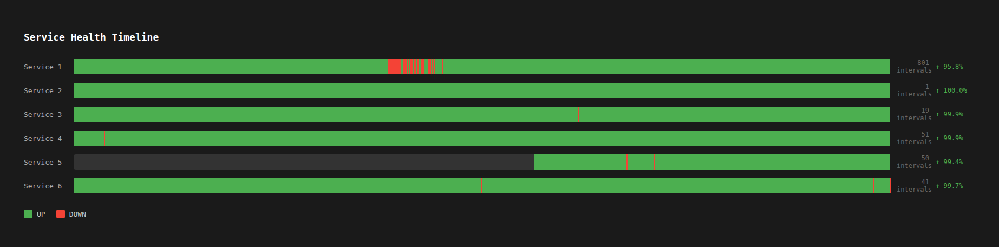

# Health Report Visualiser

A browser-based timeline viewer for the health report output. Displays one horizontal bar per service with green segments for UP and red for DOWN periods.

## Requirements

- Python 3.6 or higher
- Flask 2.0.1 or higher

## Installation

```bash
pip install -r requirements.txt
```

## Usage

First generate the output CSV using `health_report.py`, then run the app pointing at it:

```bash
python3 app.py <output.csv>
```

Then open [http://127.0.0.1:5000](http://127.0.0.1:5000) in your browser.

## Screenshot



## Features

- One timeline bar per service
- Green for UP, red for DOWN
- Hover over a segment to see status, start time, end time, and duration
- UP% shown per service
- Interval count shown per service
